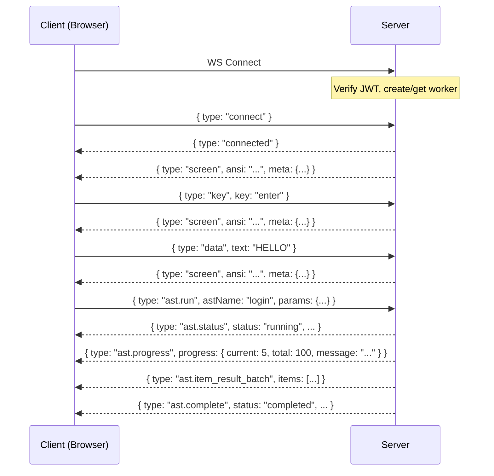

# API Reference

## Overview

The server exposes a REST API and a WebSocket endpoint. All routes (except health/docs) require a valid Azure Entra ID JWT Bearer token.

**Base URL:** `http://localhost:3000` (dev) / `https://iast-api.apps.rosa.example.com` (prod)
**Swagger UI:** `GET /docs`

## REST Endpoints

### Health & Metrics

| Method | Path | Auth | Description |
|--------|------|------|-------------|
| `GET` | `/ping` | No | Simple liveness probe |
| `GET` | `/health` | No | Health check with DB connectivity |
| `GET` | `/metrics` | No | Active/max worker counts for HPA |

```
GET /ping
Response: { "pong": true }

GET /health
Response: { "status": "ok", "timestamp": "2026-03-06T...", "db": true }

GET /metrics
Response: { "activeWorkers": 12, "maxWorkers": 50 }
```

### Authentication

| Method | Path | Auth | Description |
|--------|------|------|-------------|
| `GET` | `/auth/me` | Yes | Current user profile |

```
GET /auth/me
Headers: Authorization: Bearer <JWT>
Response: { "id": "uuid", "email": "user@example.com", "displayName": "John Doe" }
```

### Sessions

| Method | Path | Auth | Description |
|--------|------|------|-------------|
| `GET` | `/sessions` | Yes | List user's sessions |
| `POST` | `/sessions` | Yes | Create new session |
| `PATCH` | `/sessions/:id` | Yes | Rename session |
| `DELETE` | `/sessions/:id` | Yes | Delete session and destroy worker |

```
POST /sessions
Body: { "name": "My Session" }
Response: { "id": "ses_abc123", "name": "My Session", ... }

PATCH /sessions/:id
Body: { "name": "Renamed" }

DELETE /sessions/:id
Response: { "success": true }
```

### Execution History

| Method | Path | Auth | Description |
|--------|------|------|-------------|
| `GET` | `/history` | Yes | Paginated execution history |
| `GET` | `/history/:id/policies` | Yes | Policy results for an execution |

```
GET /history?date=2026-03-06&limit=20&cursor=exec_abc
Response: {
  "executions": [ { "id": "exec_1", "astName": "login", "status": "completed", ... } ],
  "nextCursor": "exec_xyz"
}

GET /history/:id/policies
Response: {
  "policies": [
    { "id": "uuid", "policyNumber": "POL123", "status": "success", "durationMs": 145 }
  ]
}
```

### AST Configurations

| Method | Path | Auth | Description |
|--------|------|------|-------------|
| `GET` | `/ast-configs` | Yes | List visible configs (own + public) |
| `POST` | `/ast-configs` | Yes | Create config |
| `PATCH` | `/ast-configs/:id` | Yes | Update config (owner only) |
| `DELETE` | `/ast-configs/:id` | Yes | Delete config (owner only) |
| `POST` | `/ast-configs/:id/clone` | Yes | Clone config as private copy |

```
POST /ast-configs
Body: {
  "astName": "bi-renew",
  "name": "My BI Config",
  "visibility": "private",
  "params": { "region": "MW" },
  "tasks": [{ "id": "t1", "label": "POL123", "enabled": true, "params": {} }]
}

POST /ast-configs/:id/clone
Body: { "name": "Cloned Config" }
```

### AutoLaunchers

| Method | Path | Auth | Description |
|--------|------|------|-------------|
| `GET` | `/auto-launchers` | Yes | List visible launchers |
| `POST` | `/auto-launchers` | Yes | Create launcher |
| `PATCH` | `/auto-launchers/:id` | Yes | Update launcher |
| `DELETE` | `/auto-launchers/:id` | Yes | Delete launcher |
| `GET` | `/auto-launcher-runs` | Yes | List past runs |

```
POST /auto-launchers
Body: {
  "name": "Full Renewal Pipeline",
  "visibility": "private",
  "steps": [
    { "id": "s1", "astName": "login", "order": 0, "params": { ... } },
    { "id": "s2", "astName": "bi-renew", "order": 1, "configId": "uuid", "params": { ... } }
  ]
}
```

### Schedules

| Method | Path | Auth | Description |
|--------|------|------|-------------|
| `GET` | `/schedules` | Yes | List user's schedules |
| `POST` | `/schedules` | Yes | Create scheduled execution |
| `DELETE` | `/schedules/:id` | Yes | Cancel pending schedule |

```
POST /schedules
Body: {
  "astName": "bi-renew",
  "scheduledTime": "2026-03-07T08:00:00Z",
  "params": { ... },
  "credentials": { "userId": "USER01", "password": "..." }
}
```

Credentials are encrypted (AES-256-GCM) before storage. The EventBridge schedule is created with an `at(...)` expression.

## WebSocket Protocol

### Connection

```
WS /api/terminal/:sessionId?token=<JWT>
```

Authentication via `token` query parameter (verified server-side). On invalid token, the connection is closed with code `4001`.

### Message Flow



### Client -> Server Messages

```typescript
type ClientMessage =
  | { type: 'connect'; host: string; port: number; options?: Record<string, unknown> }
  | { type: 'disconnect' }
  | { type: 'key'; key: string }          // 3270 AID keys: enter, pf1-24, pa1-3, tab, etc.
  | { type: 'data'; text: string }         // Type characters
  | { type: 'cursor'; row: number; col: number }  // Move cursor
  | { type: 'ast.run'; astName: ASTName; params: Record<string, unknown>; configId?: string }
  | { type: 'ast.control'; action: 'pause' | 'resume' | 'cancel' }
```

**Key names:** `enter`, `clear`, `keyTab`, `keyBacktab`, `pf1`-`pf24`, `pa1`-`pa3`, `reset`, `keyBackspace`, `keyDelete`, `keyCurUp`, `keyCurDown`, `keyCurLeft`, `keyCurRight`, `keyHome`, `keyEnd`, `keyEraseEof`

### Server -> Client Messages

```typescript
type ServerMessage =
  | { type: 'connected' }
  | { type: 'disconnected'; reason?: string }
  | { type: 'screen'; ansi: string; meta: ScreenMeta }
  | { type: 'ast.status'; status: ASTStatus; astName: ASTName; executionId: string }
  | { type: 'ast.progress'; progress: ASTProgress }
  | { type: 'ast.item_result_batch'; executionId: string; items: ASTItemResult[] }
  | { type: 'ast.complete'; status: ASTStatus; executionId: string; error?: string }
  | { type: 'error'; message: string; code?: string }

interface ScreenMeta {
  cursorRow: number
  cursorCol: number
  locked: boolean
  rows: number
  cols: number
}
```

### Screen Meta

Every `screen` message includes metadata:

| Field | Type | Description |
|-------|------|-------------|
| `cursorRow` | number | Current cursor row (1-based) |
| `cursorCol` | number | Current cursor column (1-based) |
| `locked` | boolean | Whether keyboard is locked (X SYSTEM) |
| `rows` | number | Screen height (typically 43) |
| `cols` | number | Screen width (typically 80) |

## Error Responses

All error responses follow a consistent shape:

```json
{
  "success": false,
  "error": {
    "code": "UNAUTHORIZED",
    "message": "Missing token"
  }
}
```

| Code | HTTP Status | Description |
|------|-------------|-------------|
| `UNAUTHORIZED` | 401 | Missing or invalid JWT token |
| `FORBIDDEN` | 403 | Valid token but insufficient permissions |
| `NOT_FOUND` | 404 | Resource not found |
| `INTERNAL_ERROR` | 500 | Server-side error |
