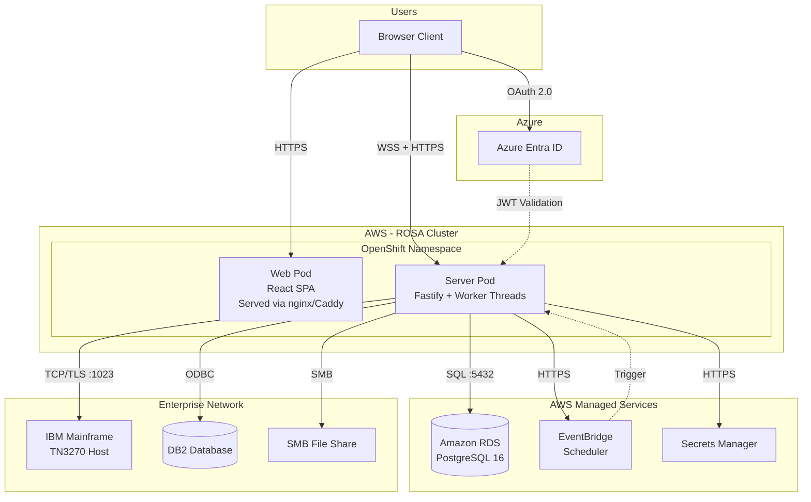
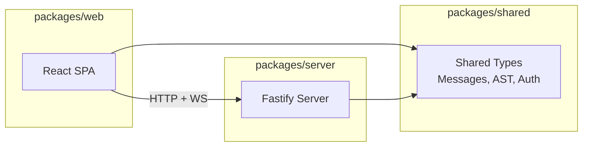
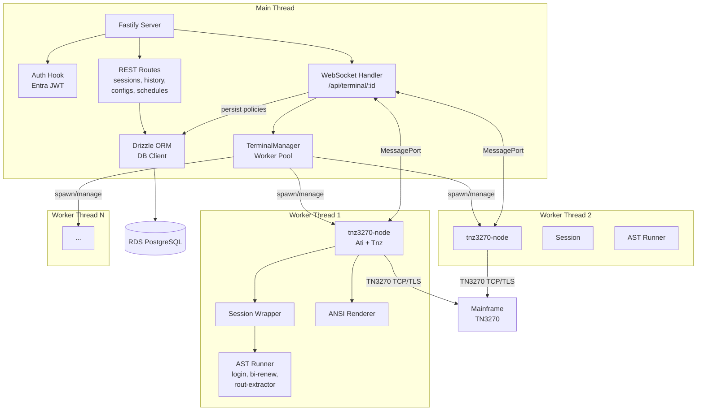
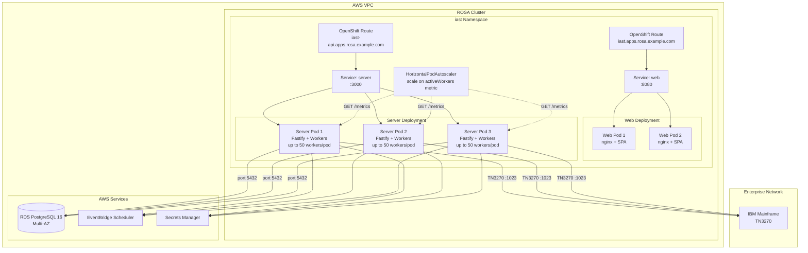
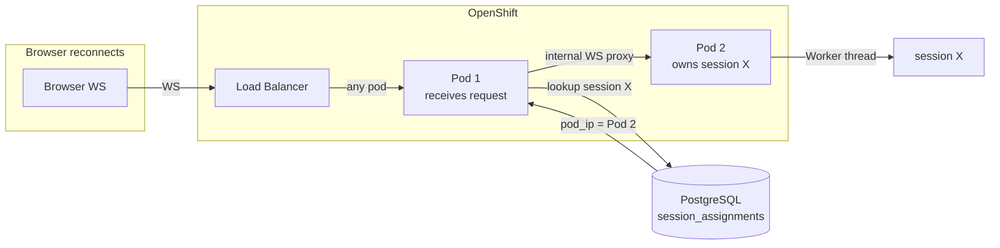
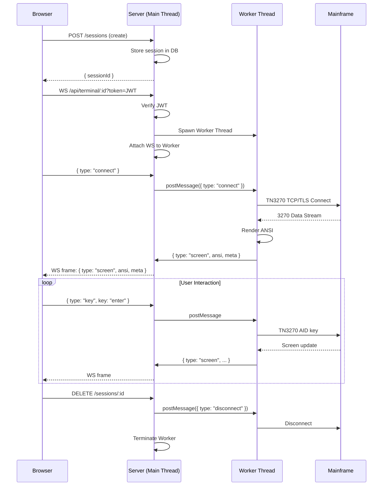
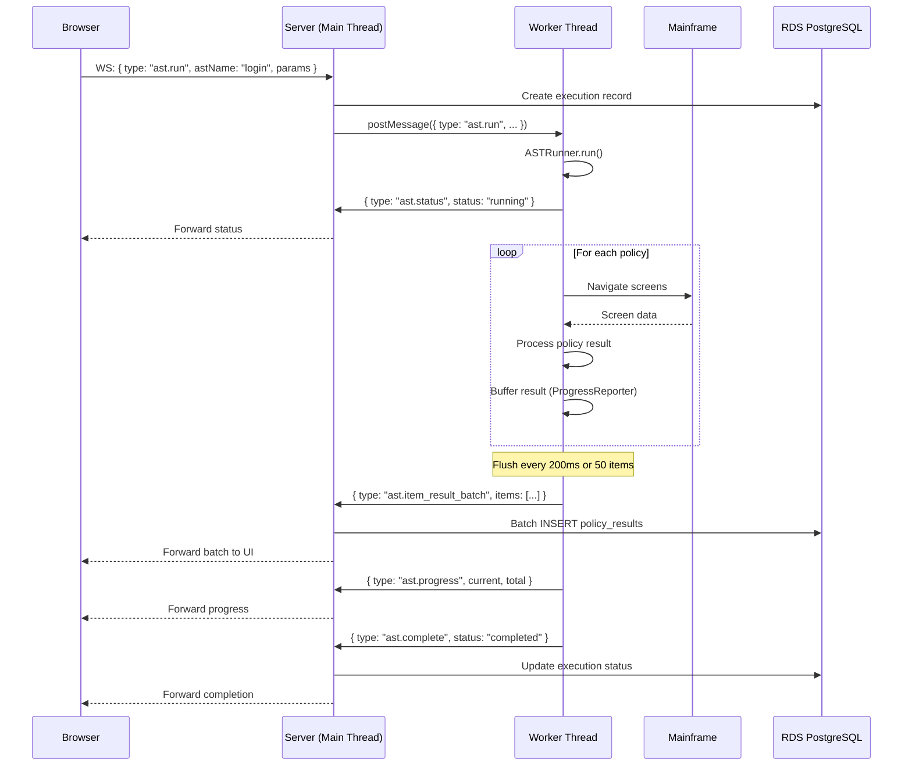
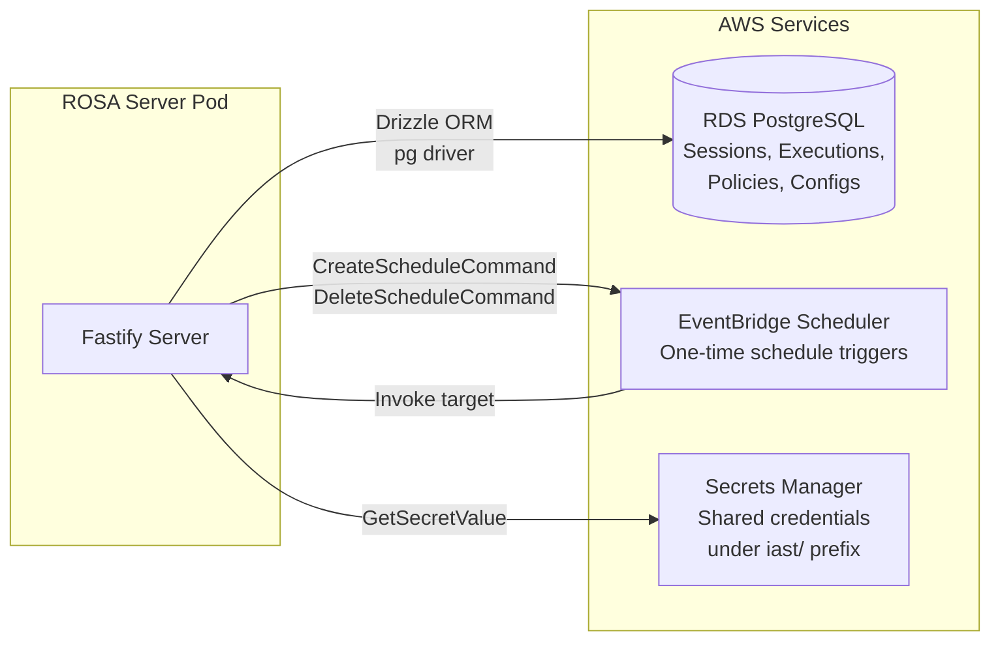

# Architecture Overview

## System Context

IAST enables users to automate interactions with IBM mainframe systems (CICS/TSO) via TN3270 terminal emulation. Users connect through a browser-based terminal, execute Automated System Tasks (ASTs) that process insurance policies in bulk, and review results through a history interface.



## High-Level Architecture

The application follows a monorepo structure with three packages sharing types:



## Server Internal Architecture

The server uses a **main thread + worker thread** model. The main thread handles all HTTP/WebSocket routing and database access. Each TN3270 terminal session runs in an isolated Worker thread, keeping the main thread responsive.



## ROSA Deployment Architecture

The application deploys to a Red Hat OpenShift Service on AWS (ROSA) cluster. OpenShift manages pod scaling, networking, and secrets.



### Session Routing (Pod Affinity Without Sticky Sessions)

Worker threads live in a single pod's memory. With multiple pods behind a load balancer, requests must reach the **correct pod** that owns the session. We solve this with a **database-backed session registry** instead of sticky load balancers.



Key components:
- **`session_assignments` table**: Maps `session_id -> pod_ip` in PostgreSQL
- **Headless Service DNS**: Discovers all pod IPs for load balancing and health checks
- **Internal WS endpoint**: Pod-to-pod proxy when request hits wrong pod
- **Least-loaded assignment**: New sessions go to the pod with fewest active workers
- **Failover**: Dead pods detected via DNS, sessions reassigned to healthy pods

See **[Session Routing](./session-routing.md)** for the full design, failure recovery, and comparison with the original iast-aws DynamoDB-based registry.

### Scaling Strategy

| Component | Scaling | Trigger |
|-----------|---------|---------|
| Web Pods | HPA 2-5 replicas | CPU utilization |
| Server Pods | HPA 2-10 replicas | `activeWorkers / maxWorkers` from `/metrics` |
| Worker Threads | Up to 50 per pod | One per active terminal session |
| RDS | Vertical (instance class) | Connection count / CPU |

The `/metrics` endpoint exposes `activeWorkers` and `maxWorkers` counts. OpenShift HPA queries this to scale server pods when worker utilization exceeds the threshold.

```
Total capacity = pods x maxWorkersPerPod
Example: 5 pods x 50 workers = 250 concurrent sessions
```

### Pod Resource Limits

```yaml
# Server pod (worker-heavy)
resources:
  requests:
    cpu: "500m"
    memory: "512Mi"
  limits:
    cpu: "2000m"
    memory: "2Gi"

# Web pod (static assets)
resources:
  requests:
    cpu: "50m"
    memory: "64Mi"
  limits:
    cpu: "200m"
    memory: "128Mi"
```

## Request Flow

### Terminal Session Lifecycle



### AST Execution Flow



## AWS Service Integration



### EventBridge Scheduler Flow

Used for deferred/scheduled AST executions:

1. User creates schedule via `POST /schedules`
2. Server encrypts credentials (AES-256-GCM) and stores in DB
3. Server creates EventBridge one-time schedule (`at(...)` expression)
4. At trigger time, EventBridge invokes target (server endpoint)
5. Server decrypts credentials, spawns worker, runs AST
6. Schedule auto-deletes after execution (`ActionAfterCompletion: DELETE`)

### Secrets Manager

Credentials with prefix `iast/` store shared mainframe host credentials. The encryption key for per-schedule credential storage comes from `ENCRYPTION_KEY` env var (injected via OpenShift Secret).
