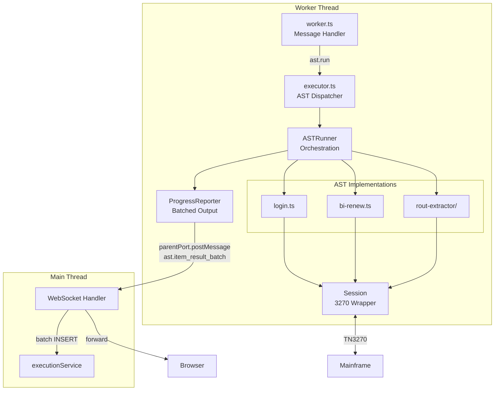
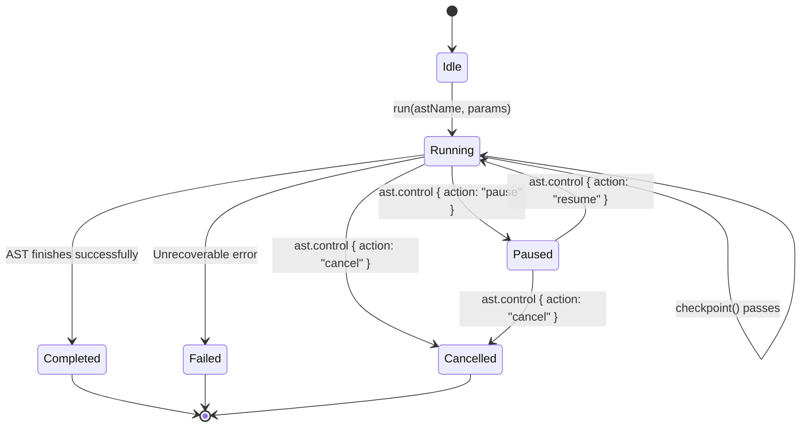
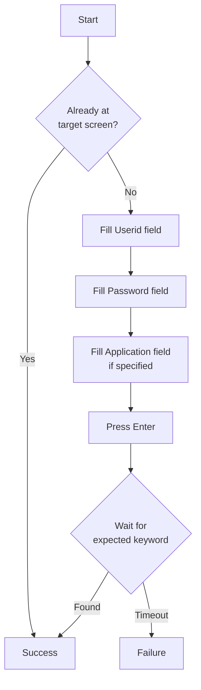
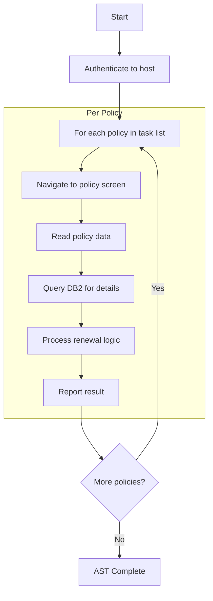
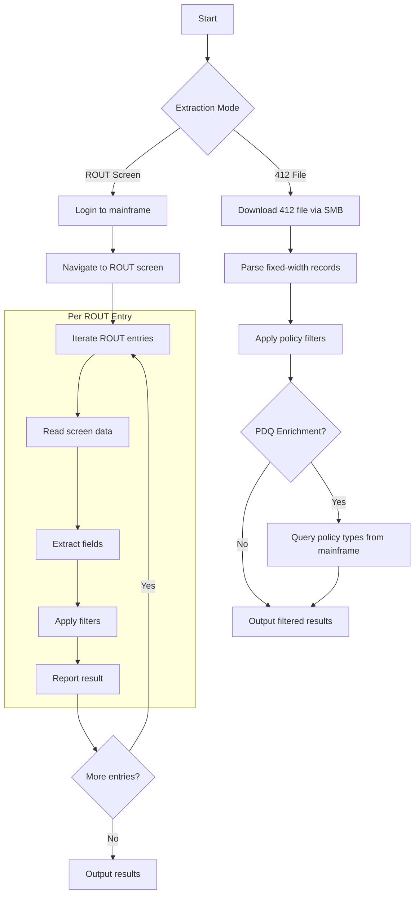
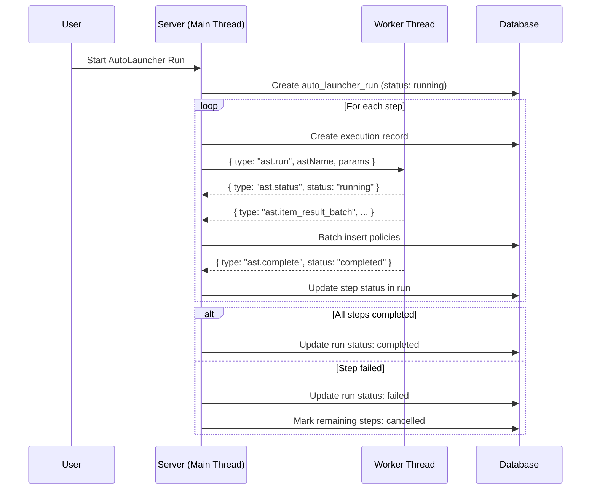

# AST Engine

## Overview

Automated System Tasks (ASTs) are pre-programmed sequences that drive the TN3270 terminal to perform bulk operations on the mainframe. The AST engine runs entirely inside Worker threads, keeping the main thread free for HTTP/WebSocket handling.

## AST Types

| AST Name | Purpose | Key Operations |
|----------|---------|----------------|
| `login` | Authenticate to mainframe | Fill userid/password fields, navigate to target screen |
| `bi-renew` | Business Insurance renewal processing | Login, iterate policies, perform renewal actions, query DB2 |
| `rout-extractor` | Route item extraction | Two modes: 412-file parsing or ROUT screen navigation |

## Execution Architecture



## ASTRunner (`ast/runner.ts`)

The runner wraps an AST implementation with lifecycle management:



### Checkpoint Mechanism

Between each policy iteration, the runner calls `checkpoint()`:
- If **paused**: blocks until resumed or cancelled
- If **cancelled**: throws `CancellationError` to unwind the stack
- If **running**: returns immediately (zero overhead)

This allows users to pause/cancel long-running ASTs mid-execution without data corruption.

## ProgressReporter (`ast/progress.ts`)

Batches individual policy results to minimize WebSocket frame overhead:

```
Configuration:
  flushInterval: 200ms
  maxBatchSize: 50 items

Behavior:
  reportItem(result)  -> Buffer in memory
  reportProgress(current, total) -> Send immediately
  flush()             -> Send buffered items as ast.item_result_batch
  Auto-flush every 200ms OR when buffer hits 50 items
```

Performance impact for 2000 policies:
- Without batching: 2000 WebSocket frames + 2000 DB inserts
- With batching: ~40 WebSocket frames + ~20 batch DB inserts

## AST Implementations

### Login AST (`ast/login.ts`)

Simple authentication automation:



### BI Renew AST (`ast/bi-renew.ts`)

Insurance renewal processing with mainframe + DB2 interaction:



Integrations used:
- **DB2**: Query policy details from IBM DB2 database
- **SMB**: Access file shares for data files

### Route Extractor AST (`ast/rout-extractor/`)

The most complex AST with two operating modes:



Sub-modules:
| File | Purpose |
|------|---------|
| `index.ts` | Entry point, mode selection |
| `file-412.ts` | Fixed-width 412 file parser |
| `filters.ts` | Policy filtering logic |
| `models.ts` | Configuration model building |
| `policy-types.ts` | PDQ policy type resolution |
| `rout-screen.ts` | Mainframe ROUT screen navigation |

## AutoLauncher

AutoLaunchers chain multiple ASTs into sequential pipelines:



## Performance Characteristics

### Server-Side

| Optimization | Detail |
|-------------|--------|
| Worker thread isolation | AST CPU work doesn't block HTTP/WS routing |
| Batched WS messages | 50 items/batch or 200ms flush interval |
| Batched DB inserts | Multi-row INSERT via Drizzle |
| Cursor-based pagination | History queries on indexed columns |
| Worker pool limits | Configurable `MAX_WORKERS` per pod (default 50) |

### Client-Side

| Optimization | Detail |
|-------------|--------|
| Virtual scrolling | `@tanstack/react-virtual` for policy result lists |
| Batched state updates | Process `ast.item_result_batch` as single Zustand update |
| Selective re-rendering | Zustand selectors per tab, React.memo on heavy components |
| Debounced progress bar | `requestAnimationFrame` throttling |

## Shared Types

```typescript
type ASTName = 'login' | 'bi-renew' | 'rout-extractor'

type ASTStatus = 'idle' | 'running' | 'paused' | 'completed' | 'failed' | 'cancelled'

interface ASTCredentials {
  userId: string
  password: string
}

interface ASTParams {
  credentials: ASTCredentials
  host?: string
  region?: string
  tasks?: ASTTask[]
  [key: string]: unknown   // AST-specific params
}

interface ASTItemResult {
  id: string
  policyNumber: string
  status: 'success' | 'failure' | 'skipped' | 'error'
  durationMs: number
  error?: string
  data?: Record<string, unknown>
}

interface ASTProgress {
  current: number
  total: number
  message: string
}
```
