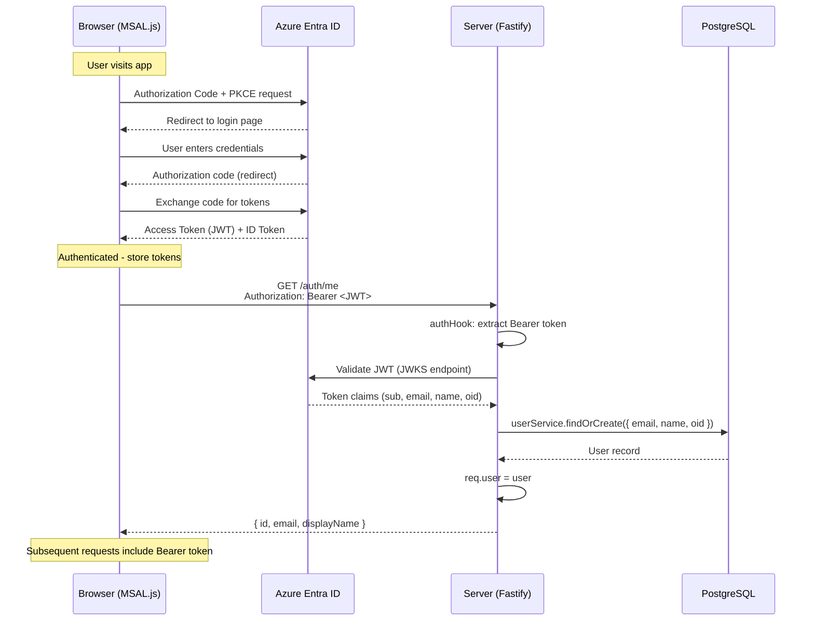

# Authentication

## Overview

Authentication uses **Azure Entra ID** (formerly Azure AD) with OAuth 2.0 / OpenID Connect. The frontend authenticates via MSAL.js (redirect flow), obtains a JWT access token, and passes it to the server on every request.

## Auth Flow



## Server-Side Auth Hook (`auth/hook.ts`)

The `authHook` runs as a Fastify `onRequest` hook on all routes.

### Skipped Routes

These routes bypass authentication entirely:
- `/ping` - Kubernetes liveness probe
- `/health` - Kubernetes readiness probe
- `/metrics` - HPA metrics endpoint
- `/docs` and `/docs/*` - Swagger UI

### Authentication Flow

1. Extract `Authorization: Bearer <token>` header
2. If missing or malformed: return `401 UNAUTHORIZED`
3. Verify JWT via `verifyEntraToken(token)`
   - Fetches JWKS from Entra's discovery endpoint
   - Validates signature, audience, issuer, expiry
4. Extract claims: `sub`, `email`, `name`, `oid`
5. Call `userService.findOrCreate()` to auto-provision user in DB
6. Set `req.user = { id, email, displayName, entraId }`
7. Request proceeds to route handler

### User Auto-Provisioning

On first authentication, the user is automatically created in the `users` table:

```
Entra Token Claims -> users table
  oid            -> entra_id
  email          -> email
  name           -> display_name
  (generated)    -> id (UUID)
```

Subsequent requests look up the existing user by `entra_id`.

## WebSocket Authentication (`auth/ws-auth.ts`)

WebSocket connections can't use HTTP headers, so the JWT is passed as a query parameter:

```
WS /api/terminal/:sessionId?token=<JWT>
```

The `verifyWsToken(token)` function performs the same JWT validation as the HTTP hook. On failure, the WebSocket is closed with code `4001`.

## Entra ID JWT Verification (`auth/entra.ts`)

Uses the `jose` library for JWT verification against Entra's JWKS endpoint.

```
JWKS URL: https://login.microsoftonline.com/{ENTRA_TENANT_ID}/discovery/v2.0/keys
Issuer: https://login.microsoftonline.com/{ENTRA_TENANT_ID}/v2.0
Audience: {ENTRA_CLIENT_ID} or {ENTRA_AUDIENCE}
```

## Frontend MSAL Configuration (`config/auth.ts`)

```typescript
// MSAL configuration
{
  auth: {
    clientId: ENTRA_CLIENT_ID,
    authority: `https://login.microsoftonline.com/${ENTRA_TENANT_ID}`,
    redirectUri: window.location.origin,
  },
  cache: {
    cacheLocation: 'sessionStorage',
  }
}

// Token scopes
scopes: [`api://${ENTRA_CLIENT_ID}/access`]
```

### AuthGuard Component

Wraps the entire app. Redirects to Entra login if no active account. Shows a loading state during token acquisition.

### Token Attachment

The `authFetch()` utility in `services/api.ts`:
1. Acquires token silently via `acquireTokenSilent()`
2. Falls back to `acquireTokenRedirect()` if silent fails (e.g., expired refresh token)
3. Attaches `Authorization: Bearer <token>` to every HTTP request

For WebSocket connections, the token is obtained once at connection time and passed as a query parameter.

## Environment Variables

### Server

| Variable | Description |
|----------|-------------|
| `ENTRA_TENANT_ID` | Azure Entra tenant ID (GUID) |
| `ENTRA_CLIENT_ID` | App registration client ID |
| `ENTRA_AUDIENCE` | Expected JWT audience (defaults to client ID) |

### Frontend (build-time)

| Variable | Description |
|----------|-------------|
| `VITE_ENTRA_TENANT_ID` | Same tenant ID |
| `VITE_ENTRA_CLIENT_ID` | Same client ID |
| `VITE_API_URL` | Server API base URL |

## Security Considerations

- Tokens are short-lived (1 hour default) with refresh token rotation
- MSAL stores tokens in `sessionStorage` (cleared on tab close)
- Server validates every request independently (stateless)
- WebSocket tokens are validated at connection time only
- Credentials for scheduled executions are encrypted with AES-256-GCM before DB storage
- `ENCRYPTION_KEY` is stored in OpenShift Secret (injected as env var)
