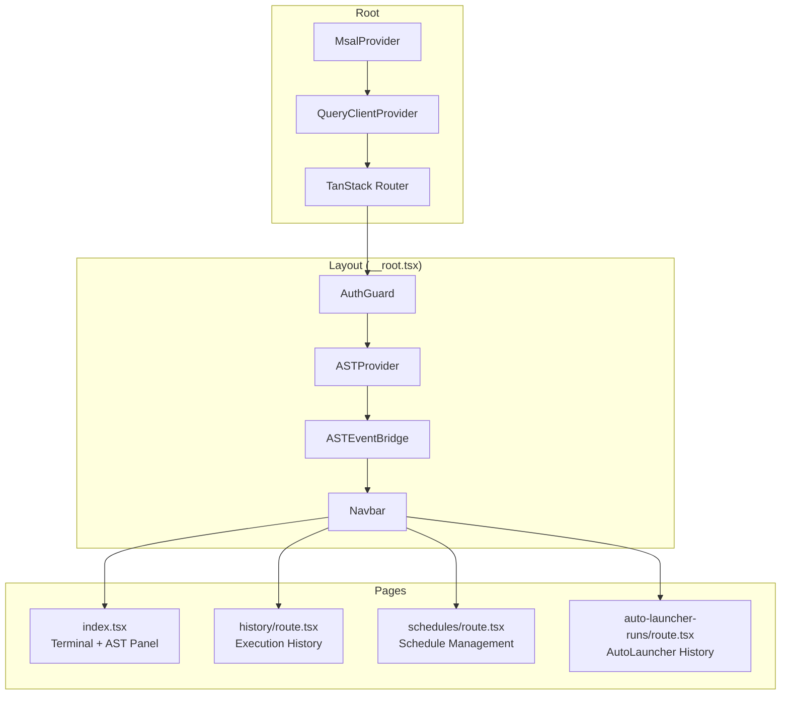
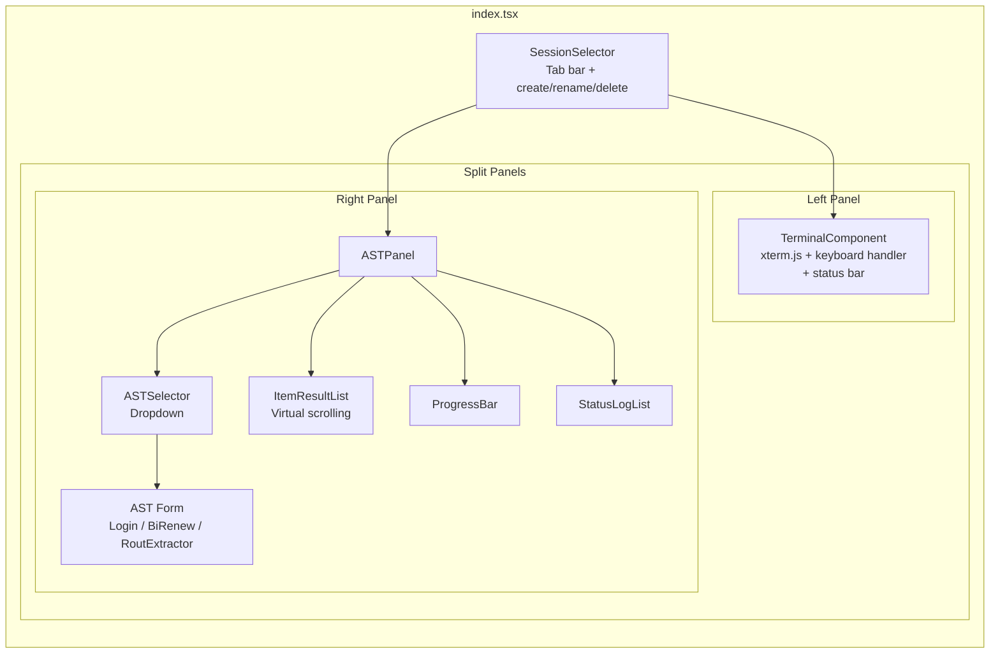
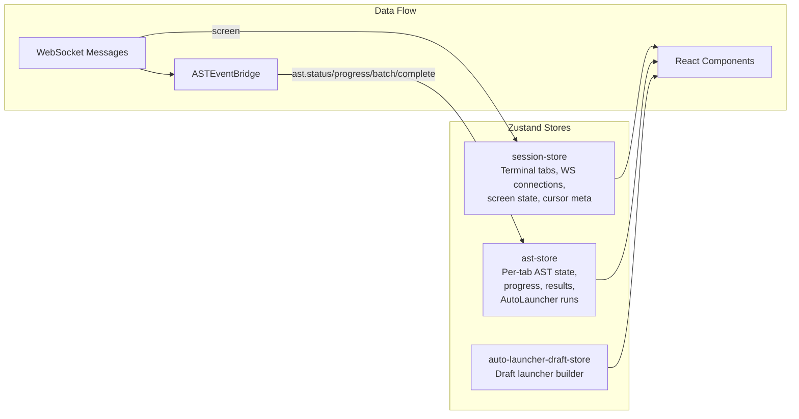
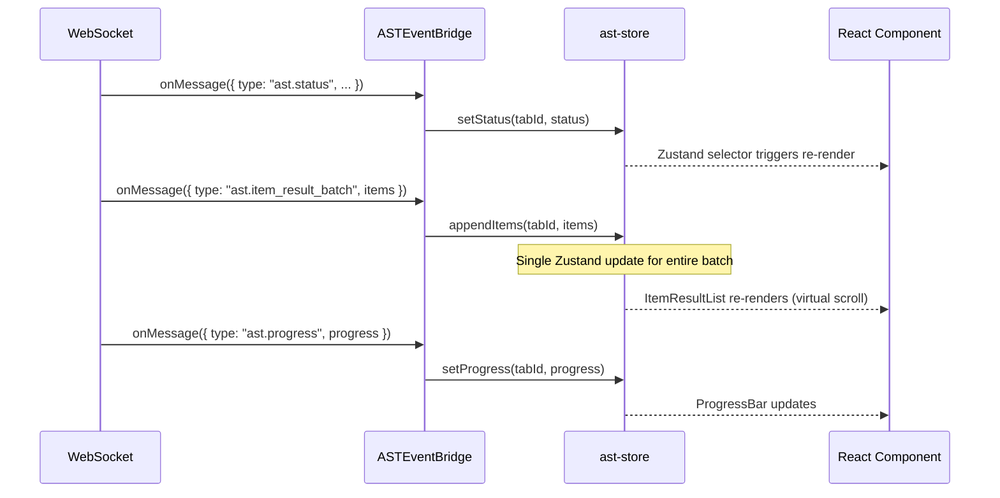
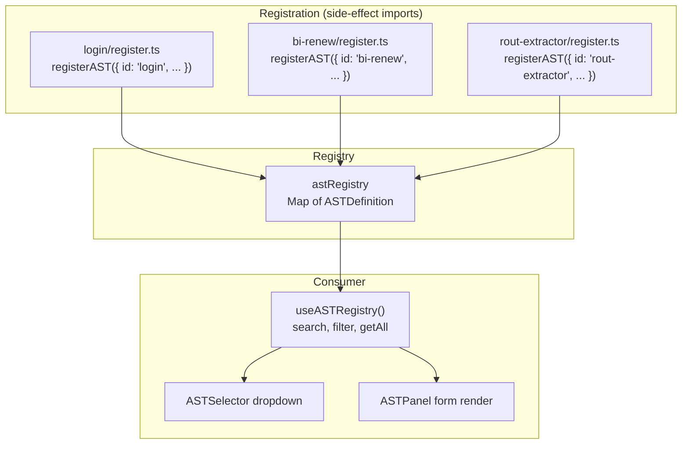
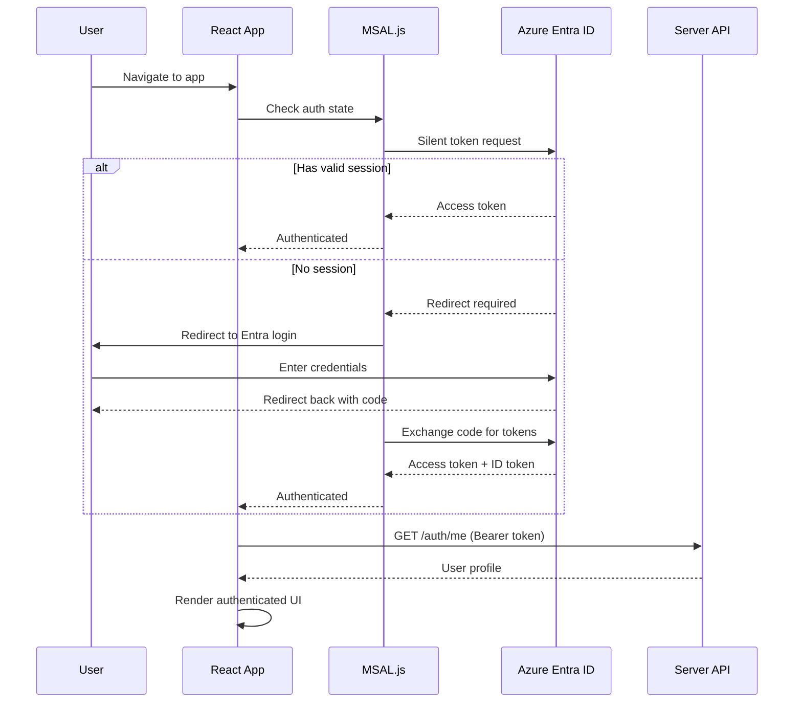

# Frontend Architecture

## Overview

The frontend is a React 19 single-page application built with Vite 7, using TanStack Router for file-based routing, Zustand for state management, and TanStack Query for server state.

## Component Tree



## Main Page Layout (Terminal + AST)



## State Management

### Store Architecture



### session-store

Manages terminal session tabs and WebSocket connections.

```typescript
interface SessionTab {
  sessionId: string
  name: string
  ws: TerminalWebSocket | null
  connected: boolean
  screenAnsi: string
  meta: {
    cursorRow: number
    cursorCol: number
    locked: boolean
  }
}

interface SessionState {
  tabs: Map<string, SessionTab>
  activeTabId: string | null

  // Actions
  addTab(sessionId: string, name: string): void
  removeTab(sessionId: string): void
  setActiveTab(sessionId: string): void
  renameTab(sessionId: string, name: string): void
  setWs(sessionId: string, ws: TerminalWebSocket): void
  setConnected(sessionId: string, connected: boolean): void
  updateScreen(sessionId: string, ansi: string, meta: ScreenMeta): void
}
```

### ast-store

Per-tab AST execution state. Each terminal tab has independent AST state.

```typescript
interface TabASTState {
  selectedASTId: string | null
  runningAST: ASTName | null
  status: ASTStatus
  executionId: string | null
  progress: ASTProgress | null
  itemResults: ASTItemResult[]
  statusMessages: string[]
  autoLauncherRun: AutoLauncherRun | null
  credentials: ASTCredentials
  formOptions: Record<string, unknown>
  customFields: Record<string, unknown>
}
```

### auto-launcher-draft-store

Draft state for building new AutoLauncher definitions before saving.

## Real-Time Update Flow



### Performance Optimizations

| Technique | Where | Impact |
|-----------|-------|--------|
| Virtual scrolling | ItemResultList (react-virtual) | ~30 DOM nodes for 2000+ results |
| Batched state updates | ASTEventBridge processes batch as single update | Prevents 50 re-renders per batch |
| Zustand selectors | Components select only needed slices | Prevent unrelated re-renders |
| React.memo | Heavy components (Terminal, ItemResultList) | Skip re-render on unchanged props |
| requestAnimationFrame | ProgressBar throttling | Max 10 visual updates/sec |

## AST Registry System

ASTs self-register at module load time. The registry provides search, filtering, and form component resolution.



Each registered AST provides:
- `id`: Unique name (`ASTName`)
- `label`: Display name
- `description`: User-facing description
- `keywords`: Search terms
- `FormComponent`: React component for the AST's parameter form

## Authentication Flow



## Services Layer

API communication functions used by hooks and components:

| Service | Functions |
|---------|-----------|
| `api.ts` | `authFetch()`, `apiGet()`, `apiPost()`, `apiPatch()`, `apiDelete()` |
| `websocket.ts` | `TerminalWebSocket` class (connect, send, onMessage, disconnect) |
| `sessions.ts` | `getSessions()`, `createSession()`, `deleteSession()`, `renameSession()` |
| `ast-configs.ts` | CRUD for AST configs |
| `auto-launchers.ts` | CRUD for launchers + runs |
| `schedules.ts` | CRUD for schedules |

All HTTP functions use `authFetch()` which automatically attaches the MSAL Bearer token.

## Hooks

| Hook | Purpose |
|------|---------|
| `useApi` | `useApiQuery()` and `useApiMutation()` wrapping TanStack Query with auth |
| `useAST` | AST execution bridge (trigger runs, handle results) |
| `useTerminal` | Terminal lifecycle management (connect, resize, cleanup) |
| `useFormField` | Form field state with localStorage persistence |
| `useAuth` | Authentication state and user info |
| `useTheme` | Dark/light mode toggle with localStorage |

## UI Components

### Shared UI (`components/ui/`)

| Component | Description |
|-----------|-------------|
| `Button` | Primary/secondary/danger variants, loading state, icons |
| `Card` | Container with header, padding, shadow |
| `Checkbox` | Labeled checkbox with indeterminate state |
| `DatePicker` | Date selection with calendar dropdown |
| `DateTimePicker` | Combined date + time picker |
| `Input` | Text input with label, error, left/right icons |
| `ItemResultList` | Virtual-scrolled policy result list |
| `Modal` | Dialog overlay with close, header, footer |
| `ProgressBar` | Segmented progress bar with percentage |
| `StatusBadge` | Colored status indicator pills |
| `StatusLogList` | Timestamped log message list |
| `Toggle` | Switch toggle with label |
| `Tooltip` | Hover tooltip with positioning |
