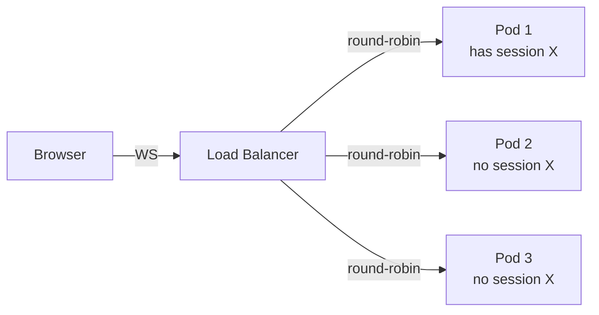
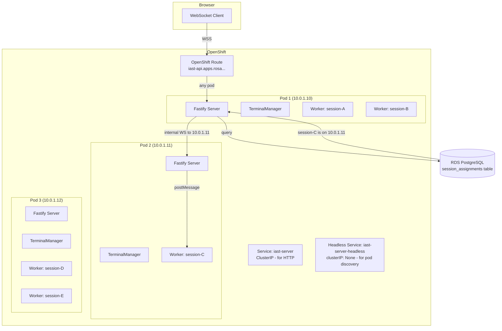
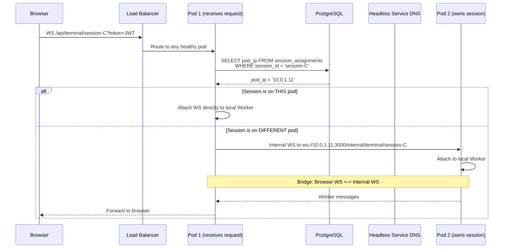
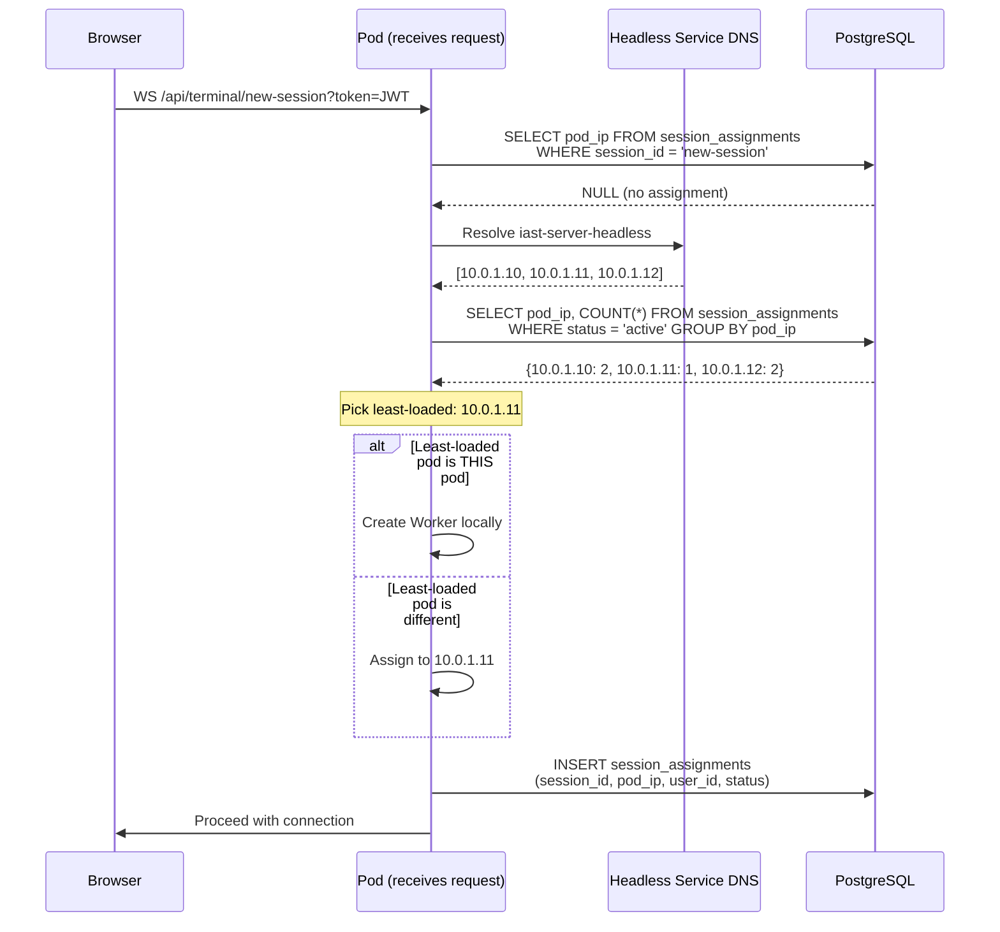
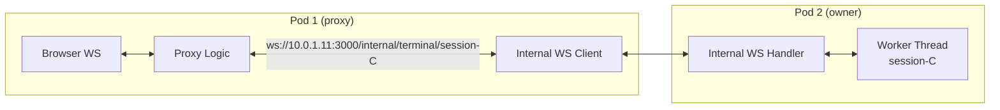
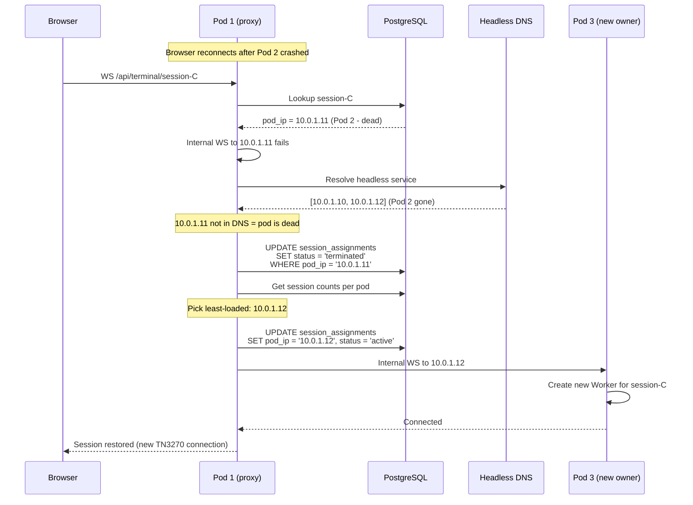

# Session Routing & Pod Affinity

## The Problem

Worker threads live in a single process's memory. When multiple server pods run behind a load balancer, a user's terminal session (Worker thread) exists on **one specific pod**. If the next request routes to a different pod, the session isn't there.



**We cannot rely on sticky sessions** (load balancer affinity) because:
- OpenShift route session affinity is cookie-based and unreliable for WebSockets
- Pod scaling events break stickiness
- Pod restarts lose the session entirely

## Solution: Database-Backed Session Registry

Store which pod IP owns each session in PostgreSQL. On every WebSocket connection, look up the owning pod and **proxy directly to it** via an internal WebSocket.

This matches the pattern from the original iast-aws (which used DynamoDB + headless service DNS), adapted for PostgreSQL + ROSA.

### Architecture



### Request Flow



### New Session Assignment



## Database Schema

### `session_assignments` Table

Tracks which pod owns each active terminal session. Replaces the DynamoDB-based registry from the original iast-aws.

```sql
CREATE TABLE session_assignments (
    session_id  TEXT PRIMARY KEY REFERENCES sessions(id) ON DELETE CASCADE,
    pod_ip      TEXT NOT NULL,
    user_id     UUID NOT NULL REFERENCES users(id),
    status      TEXT NOT NULL DEFAULT 'active',  -- 'active' | 'terminated'
    created_at  TIMESTAMPTZ NOT NULL DEFAULT now(),
    updated_at  TIMESTAMPTZ NOT NULL DEFAULT now()
);

CREATE INDEX session_assignments_pod_status_idx
    ON session_assignments (pod_ip, status)
    WHERE status = 'active';
```

| Column | Type | Description |
|--------|------|-------------|
| `session_id` | text | FK to sessions.id |
| `pod_ip` | text | IP address of the pod that owns the Worker thread |
| `user_id` | uuid | FK to users.id |
| `status` | text | `active` or `terminated` |
| `created_at` | timestamptz | When the assignment was made |
| `updated_at` | timestamptz | Last status update |

The partial index on `(pod_ip, status) WHERE status = 'active'` makes the load-counting query fast.

## Pod Discovery via Headless Service

A Kubernetes **headless Service** (`clusterIP: None`) returns individual pod IPs as DNS A records instead of a single ClusterIP. This lets any pod discover all other pods by IP.

```yaml
apiVersion: v1
kind: Service
metadata:
  name: iast-server-headless
spec:
  clusterIP: None
  selector:
    app: iast-server
  ports:
    - port: 3000
      targetPort: 3000
```

```typescript
import { lookup } from 'node:dns/promises'

async function discoverPods(): Promise<string[]> {
  // dns.lookup (NOT dns.resolve4) uses OS resolver which respects
  // /etc/resolv.conf search domains — short K8s service names work
  const results = await lookup('iast-server-headless', { all: true, family: 4 })
  return results.map(r => r.address)
}

// Returns: ['10.0.1.10', '10.0.1.11', '10.0.1.12']
```

In local development, `localhost` resolves to `['127.0.0.1']` — single-pod behavior.

## Internal Pod-to-Pod WebSocket

When a request arrives at the wrong pod, it needs to proxy to the correct one. An **internal WebSocket endpoint** runs on every pod for this purpose:

```
GET /internal/terminal/:sessionId
```

This endpoint is **not exposed via the OpenShift Route** — it's only reachable via the pod's ClusterIP on the internal network. It skips JWT auth (internal trust) and directly attaches the WebSocket to the local Worker thread.



Message bridge (same pattern as original iast-aws `bridge.ts`):
- Browser -> Proxy Pod -> Internal WS -> Owner Pod -> Worker
- Worker -> Owner Pod -> Internal WS -> Proxy Pod -> Browser

## Load Balancing Algorithm

When assigning a new session, pick the pod with the fewest active sessions:

```typescript
async function getLeastLoadedPod(): Promise<string> {
  const pods = await discoverPods()

  if (pods.length <= 1) return pods[0]

  // Query active session counts per pod
  const counts = await db.select({
    podIp: sessionAssignments.podIp,
    count: sql<number>`count(*)`,
  })
    .from(sessionAssignments)
    .where(eq(sessionAssignments.status, 'active'))
    .groupBy(sessionAssignments.podIp)

  const countMap = new Map(counts.map(r => [r.podIp, r.count]))

  let minCount = Infinity
  let candidates: string[] = []

  for (const podIp of pods) {
    const count = countMap.get(podIp) ?? 0
    if (count < minCount) {
      minCount = count
      candidates = [podIp]
    } else if (count === minCount) {
      candidates.push(podIp)
    }
  }

  // Random tie-break to avoid thundering herd
  return candidates[Math.floor(Math.random() * candidates.length)]
}
```

## Failure Recovery

### Pod Crash / Scale-Down



**Important**: When a pod dies, the Worker thread and TN3270 connection are lost. The session can be **reassigned** to a new pod, but the user will need to reconnect to the mainframe. The terminal screen resets — this is inherent to TN3270 (the mainframe doesn't maintain screen state for disconnected clients).

### Recovery Decision Matrix

| Scenario | Detection | Action |
|----------|-----------|--------|
| Session on this pod | `podIp === myPodIp` | Attach directly to local Worker |
| Session on another live pod | Internal WS succeeds | Bridge browser to that pod |
| Session on dead pod | Internal WS fails + pod not in DNS | Reassign to least-loaded pod |
| Session on live pod, transient error | Internal WS fails + pod in DNS | Retry same pod after 1s delay |
| New session | No DB record | Assign to least-loaded pod |
| Already retried and failed | isRetry = true | Return error to browser |

## Comparison with Original iast-aws

| Aspect | Original (iast-aws) | New (iast-aws-node) |
|--------|---------------------|---------------------|
| Session storage | DynamoDB (`SESSION#/TERMINAL#mapping`) | PostgreSQL `session_assignments` table |
| Pod discovery | Headless Service DNS (`dns.lookup`) | Same |
| Load balancing | Scan DynamoDB, count per pod, pick min | Query PostgreSQL, same algorithm |
| Terminal runtime | Separate Python pod (WebSocket :8080) | Worker thread in same process |
| Internal routing | API -> Python pod WS | Pod -> Pod internal WS |
| TTL cleanup | DynamoDB TTL (24h) | Application-level cleanup on pod exit |
| Failover | DNS check + DynamoDB reassign | DNS check + PostgreSQL reassign |

## Self-Pod IP Detection

Each pod needs to know its own IP to detect "session is on this pod" (local fast path). In Kubernetes, inject via the Downward API:

```yaml
env:
  - name: POD_IP
    valueFrom:
      fieldRef:
        fieldPath: status.podIP
```

In local dev, defaults to `127.0.0.1`.

## Configuration

| Variable | Default | Description |
|----------|---------|-------------|
| `POD_IP` | `127.0.0.1` | This pod's IP (injected by K8s Downward API) |
| `TN3270_HOST` | `localhost` | Headless service name for pod discovery |
| `MAX_WORKERS` | `50` | Max Worker threads per pod |
| `INTERNAL_WS_PATH` | `/internal/terminal` | Internal pod-to-pod WS path |

## OpenShift Services

Two services are needed:

```yaml
# Regular service for external traffic (OpenShift Route → this)
apiVersion: v1
kind: Service
metadata:
  name: iast-server
spec:
  selector:
    app: iast-server
  ports:
    - port: 3000
---
# Headless service for pod discovery (DNS returns individual pod IPs)
apiVersion: v1
kind: Service
metadata:
  name: iast-server-headless
spec:
  clusterIP: None
  selector:
    app: iast-server
  ports:
    - port: 3000
```

The regular Service is used by the OpenShift Route for external traffic. The headless Service is used internally by pods to discover each other's IPs.
