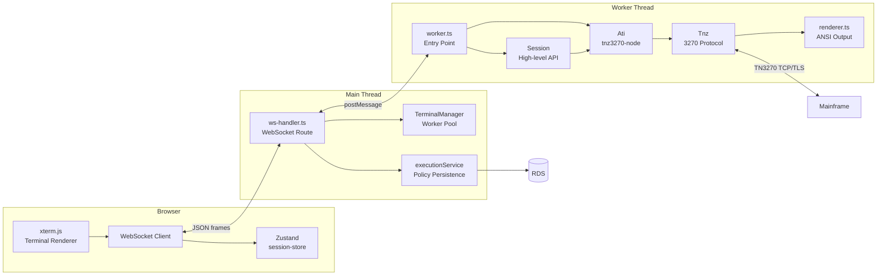
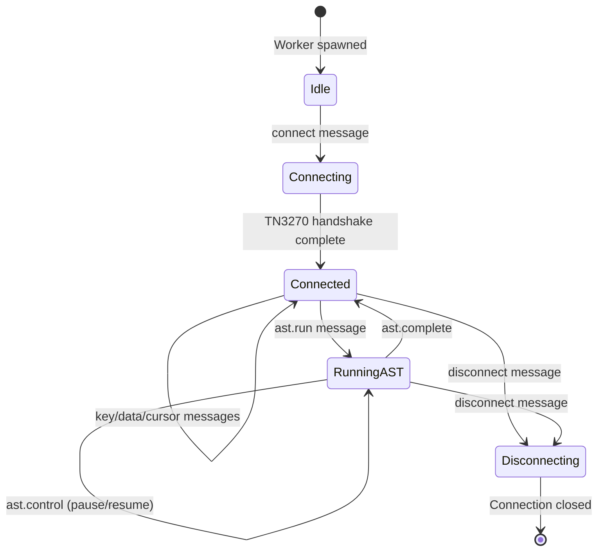
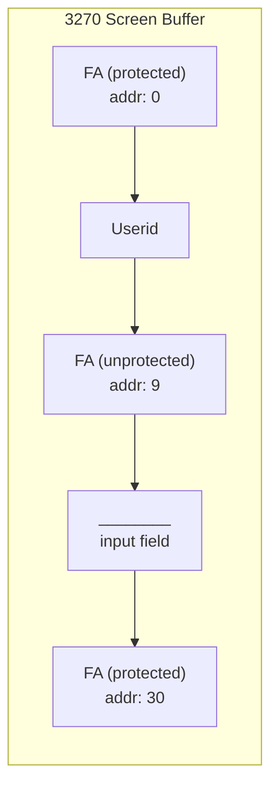

# Terminal System

## Overview

The terminal system provides browser-based IBM 3270 terminal emulation. Each user session runs in an isolated Node.js Worker thread that owns a TN3270 connection to the mainframe. The main thread bridges browser WebSockets to worker threads.

## Architecture



## Component Details

### TerminalManager (`terminal/manager.ts`)

Singleton that manages the worker thread pool. Runs on the main thread.

```
TerminalManager
  workers: Map<sessionId, { worker: Worker, ws: WebSocket | null }>
  maxWorkers: number (from config, default 50)

Methods:
  createWorker(sessionId)      - Spawn new Worker, register error/exit handlers
  getOrCreateWorker(sessionId) - Get existing or create new
  attachWebSocket(sessionId, ws)   - Bind browser WS to worker
  detachWebSocket(sessionId)       - Unbind on disconnect
  destroySession(sessionId)    - Send disconnect, schedule terminate after 1s
  destroyAll()                 - Clean shutdown of all workers
  getActiveCount()             - For /metrics HPA endpoint
  getMaxWorkers()              - Config value
```

Worker lifecycle:
- Created when a WebSocket connects to `/api/terminal/:sessionId`
- Destroyed when session is deleted or on worker error/crash
- On abnormal exit, automatically removed from pool

### WebSocket Handler (`terminal/ws-handler.ts`)

Route: `GET /api/terminal/:sessionId?token=JWT`

Bridges two directions:
1. **Browser -> Worker**: Parse JSON from WS frame, `worker.postMessage(msg)`
2. **Worker -> Browser**: Listen `worker.on('message')`, `socket.send(JSON.stringify(msg))`

Special handling for `ast.item_result_batch` messages: also batch-inserts policy results into PostgreSQL via `executionService.batchInsertPolicies()`.

### Worker Thread (`terminal/worker.ts`)

Entry point for each worker. Owns the TN3270 connection.



Message handling:

| Incoming (Main -> Worker) | Action |
|--------------------------|--------|
| `connect` | Initialize Ati, connect to TN3270 host |
| `disconnect` | Close TN3270 connection |
| `key` | Send 3270 AID key (enter, pf1-24, pa1-3, tab, etc.) |
| `data` | Type text at current cursor position |
| `cursor` | Move cursor to row/col |
| `ast.run` | Dispatch to AST executor |
| `ast.control` | Pause/resume/cancel running AST |

| Outgoing (Worker -> Main) | When |
|---------------------------|------|
| `connected` | TN3270 connection established |
| `disconnected` | Connection closed (normal or error) |
| `screen` | After every screen update (ANSI + metadata) |
| `ast.status` | AST starts, pauses, resumes |
| `ast.progress` | Progress counter update |
| `ast.item_result_batch` | Batch of processed policy results |
| `ast.complete` | AST finished (success/failure/cancelled) |
| `error` | Unrecoverable error |

### Session Class (`ast/session.ts`)

High-level wrapper over `tnz3270-node` Ati/Tnz. Provides named methods matching the Python Host class API. All row/col parameters use 1-based indexing.

Key methods:

```
Screen Navigation:
  enter(text?)              - Send Enter key, optionally with preceding text
  clear()                   - Send Clear key
  tab() / backtab()         - Field navigation
  pf(n) / pa(n)             - Function keys

Text Input:
  type(text)                - Type text at cursor
  fillFieldAtPosition(row, col, text) - Direct position fill
  fillFieldByLabel(label, value)      - Field-attribute-aware label search

Screen Reading:
  getTextAt(row, col, length) - Extract text
  getRow(row)               - Full row text
  getFullScreen()           - All rows concatenated
  hasText(text)             - Case-insensitive search
  screenContains(text)      - Alias for hasText

Waiting:
  waitForText(text, timeout?)     - Wait until text appears
  waitForTextGone(text, timeout?) - Wait until text disappears
  waitForKeyboard(timeout?)       - Wait until keyboard unlocked
  waitForAnyText(texts[], timeout?) - Wait for first match

Authentication:
  authenticate({ username, password, expectedKeywords }) - Full login flow
  logoff({ usePa3?, targetKeywords? })                   - Navigate to logoff
```

### Field-Attribute-Aware Positioning

The `fillFieldByLabel` method uses 3270 field attributes to find actual input fields, not naive text positions. This is critical because typing on protected fields is silently ignored.



Algorithm:
1. Scan `tnz.fields()` for all field attribute positions
2. Filter to unprotected fields (bit 0x20 = 0)
3. Find label text position in screen buffer via `tnz.scrstr()`
4. Pick closest unprotected field **after** the label
5. Set `tnz.curadd` to field data start address
6. Call `tnz.keyEraseEof()` to clear, then `tnz.keyData(value)` to type

### ANSI Renderer (`terminal/renderer.ts`)

Converts 3270 screen buffer (character plane + attribute plane) to ANSI escape sequences for xterm.js display. Handles:
- Character attributes (color, highlighting, reverse video)
- Field attributes (protected/unprotected visual distinction)
- Cursor positioning
- Screen dimensions (typically 80x43 model 4)

## Browser-Side Terminal

### xterm.js Integration (`terminal/Terminal.tsx`)

The `TerminalComponent` wraps xterm.js with 3270-specific keyboard mapping:

| Browser Key | 3270 Action |
|-------------|-------------|
| Enter | Enter AID |
| Escape | Reset |
| Tab | Tab (next unprotected field) |
| F1-F12 | PF1-PF12 |
| Shift+F1-F12 | PF13-PF24 |
| Ctrl+C | PA1 |
| Ctrl+R | Reset |
| Backspace | Backspace (delete left) |
| Delete | Delete character |
| Home / End | Field home / field end |
| Arrow keys | Cursor movement |
| Regular chars | Type character at cursor |

Clipboard operations (Ctrl+C for copy, Ctrl+V for paste) are intercepted via `attachCustomKeyEventHandler` and delegated to the browser.

### Session Store (`stores/session-store.ts`)

Zustand store managing all terminal tab state:

```typescript
interface SessionTab {
  sessionId: string
  name: string
  ws: TerminalWebSocket | null
  connected: boolean
  screenAnsi: string
  meta: { cursorRow: number; cursorCol: number; locked: boolean }
}

// State: Map<sessionId, SessionTab>
// Actions: addTab, removeTab, setActiveTab, renameTab, setWs, setConnected, updateScreen
```
