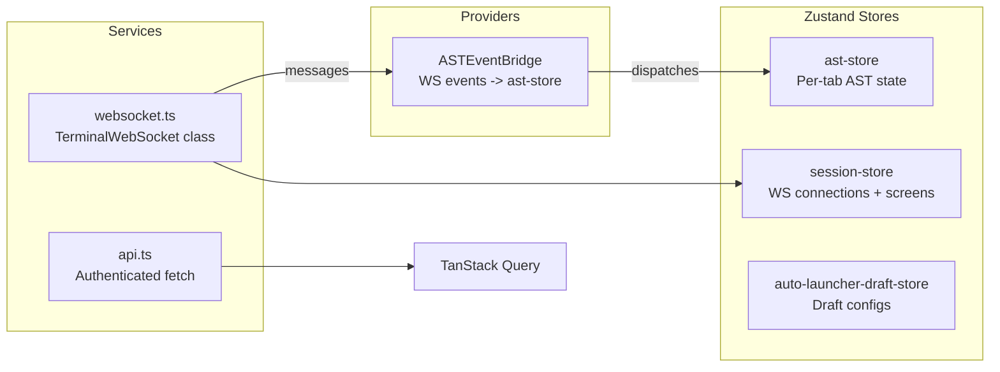

# @iast-aws-node/web

React frontend for the IAST terminal automation platform.

## Stack

- React 19 + TypeScript
- Vite (dev server + build)
- TanStack Router (file-based routing)
- TanStack Query (server state)
- Zustand (client state)
- Tailwind CSS v4
- xterm.js (terminal emulator)
- MSAL (Azure Entra ID auth)
- lucide-react (icons)

## Pages

| Route | Description |
|-------|-------------|
| `/` | Terminal - multi-tab TN3270 sessions with AST controls |
| `/history` | Execution history - browse executions, policies, and details |
| `/auto-launcher-runs` | AutoLauncher monitoring - live step progress |
| `/schedules` | Scheduled executions management |

## State Architecture



### Key data flow

1. **Terminal sessions**: `session-store` manages WS connections per tab. Each tab has a `TerminalWebSocket` instance.
2. **AST execution**: `ASTEventBridge` subscribes to WS messages and dispatches to `ast-store`. Status, progress, and item results update in real-time.
3. **History/AutoLauncher pages**: Use TanStack Query for DB data, overlay live AST store status for running executions.

## Development

```bash
npm run dev:web    # Start Vite dev server
npm run build:web  # Production build
npm run test:web   # Run tests
npm run lint       # Lint all packages
```
